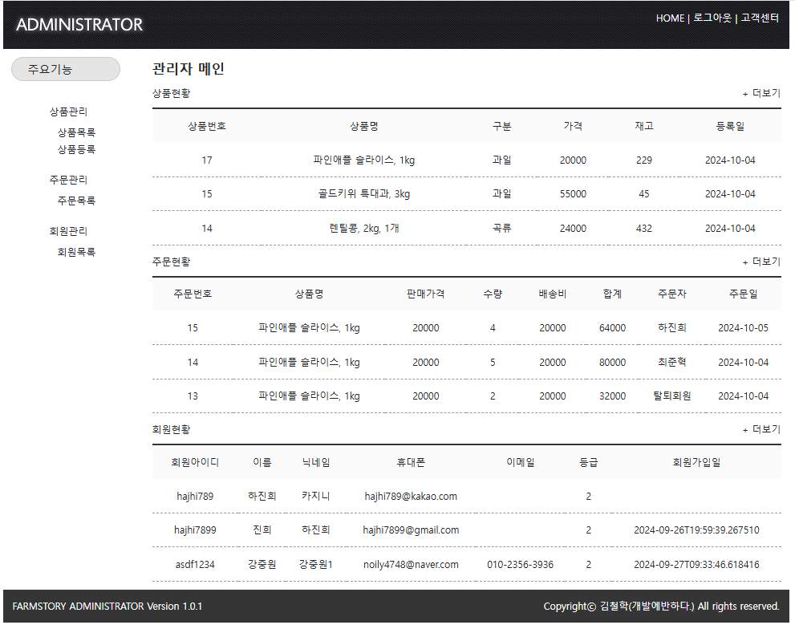

# 🌾 Farmstory: 커뮤니티 농산품 상거래 플랫폼 🌾

---

## 🛠️ 프로젝트 개요

### 📋 프로젝트 소개
**Farmstory**는 농산물 거래를 위한 커뮤니티 기반의 농산물 상거래 플랫폼입니다.  
회원과 관리자가 효율적으로 상품을 관리 및 거래할 수 있도록 설계된 웹 애플리케이션입니다.

---

### 👨‍💻 개발 인원 및 기간
- **개발 인원**: 4명  
- **개발 기간**: 2024-09-27 ~ 2024-10-04 (8일)  

---

### 📌 **나의 역할**
1. **회원 인증 및 소셜 로그인 구현**
   - Spring Security와 OAuth 2.0을 활용한 로그인 및 권한 관리
   - Google OAuth 기반 소셜 로그인 기능 구현 (Google, Kakao)

2. **관리자 기능**
   - 권한에 따른 접속 페이지 구분 (관리자만 관리자페이지 접근 가능)
   - 회원 및 상품 관리
   - 블랙리스트 회원 접속 불가  

2. **게시판 및 게시물 관리**
   - CRUD(Create, Read, Update, Delete) 기능을 통해 사용자들이 게시물 작성 및 관리
   - HTML과 Thymeleaf를 사용해 서버에서 동적으로 콘텐츠를 렌더링(SSR)

3. **보안 및 접근 제어**
   - Spring Security를 통한 사용자 역할 기반 접근 제어(관리자, 유저) 구현.
   - 관리자 페이지와 일반 사용자 페이지를 구분

4. **데이터 관리**
   - JPA를 활용한 효율적인 데이터베이스 접근 및 처리
   - Repository 패턴을 사용해 데이터 처리와 비즈니스 로직을 분리하여 유지보수성 향상.

5. **서버 관리 및 배포**
   - AWS EC2에 서버 배포 및 서버 관리
   - GitHub Actions를 통해 자동화된 CI/CD 파이프라인 구축

---

### 🏆 성과 및 결과
- 기한 내 프로젝트 목표 기능 100% 구현
- 학원 전체 팀중 1위 달성 

---

## 💻 사용 기술

| **분야**       | **기술 스택**                                               |
|----------------|------------------------------------------------------------|
| **Frontend**   | HTML, CSS, JavaScript                                       |
| **Backend**    | Spring Boot, JPA, QueryDSL, MyBatis                         |
| **Database**   | MySQL                                                      |
| **Deploy**     | AWS (EC2)                                                  |
| **Versioning** | Git                                                        |
| **CI/CD**      | GitHub Actions                                             |

---

## 🌟 주요 기능

1. **메인페이지**
   - 히트, 추천, 최신, 인기, 할인 상품 표시
   - 상단 메뉴 클릭 시 해당 위치로 이동 (스무스 스크롤)

2. **회원 기능**
   - 로그인, 소셜 로그인
   - 일반/판매자 회원가입
   - 이메일 인증 및 유효성 검사

3. **Market**
   - 장바구니 담기 및 상품 주문 기능 구현

4. **마이페이지**
   - 주문내역, 포인트, 상품평, 문의내역 확인
   - 기본 정보 수정 기능 제공

5. **관리자(Admin)**
   - 회원 관리, 상품 관리, 주문 관리
   - 회원 탈퇴 및 블랙리스트 관리

6. **회사 소개**
   - 회사 정보, 찾아오시는 길 페이지

---

## 📫 문의하기
Farmstory 프로젝트에 대해 궁금한 점이 있으시면 언제든지 연락해 주세요!
- **Email**: loveu9911111@gmail.com

---

## 🖼️ 스크린샷

### 메인 페이지

### 관리자 페이지

---

✨ **Farmstory 프로젝트에 관심을 가져주셔서 감사합니다!** ✨
# Farmstory
